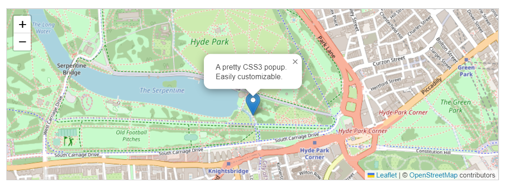

# Ejercicio individual para Rama profesional

## Estructura de la herramienta
El objetivo de la página TornadoInSight es proporcionar una forma de mostrar la información almacenada en el endpoint de SPARQL de Fuseki, el cual se ha desarrollado durante la asignatura. Para ello se utilizan dos maneras diferentes de mostrar los tornados y eventos: visualizarlos en un mapa y acceder a la información detallada de los mismos mediante una búsqueda.
La página cuenta con 4 vistas diferentes:
- Página principal
- Mapa interactivo
- Búsqueda de tornados
- Información de evento

En la página principal se muestra información de la página y sobre las opciones que esta ofrece.
  
En el mapa interactivo, se muestra un mapa en el cual ver los diferentes tornados y eventos relacionados. 

La búsqueda de tornados permite buscar tornados por fecha y magnitud del mismo.

A través de la búsqueda se puede acceder a la información del tornado específico.
## Funcionamiento de la herramienta
### Mapa interactivo
El mapa se ha implementado mediante la librería leafletjs. Esta librería permite mostrar un mapa en la página y realizar modificaciones de forma programática sobre el mismo, como mover su punto de vista, hacer zoom y añadir marcadores.
El mapa interactivo cuenta con 3 opciones:
- Ver todos los tornados en el mapa
- Ver los tornados y sus eventos relacionados en el mapa
- Eliminar los marcadores del mapa

  
Al seleccionar ver todos los tornados en el mapa, se verán todos los tornados considerados como eventos principales (ya sean los obtenidos desde la base de datos NOAA o desde tuits).
  
Todos los marcadores se mostrarán a partir de las coordenadas obtenidas del servidor Fuseki.
  

  
Para ver los tornados y sus eventos relacionados se deberá seleccionar en primer lugar un tornado.
  
Debe notarse que el número de tornados que se muestran es mucho menor que los de la opción anterior. Esto se debe a que solo se pueden seleccionar aquellos que tengan eventos asociados, de los cuales hay 5 en el momento del despliegue de la aplicación.
  

  
El tornado principal se muestra con un marcador azul, mientras que los eventos relacionados se muestran con marcadores verdes.
  
Al seleccionar la opción de eliminar los marcadores en el mapa o al seleccionar una de las opciones anteriores, todos los marcadores se eliminarán del mapa.
### Búsqueda de tornados
La búsqueda de los tornados permite acceder a la información detallada de los mismos. Se puede aplicar 3 tipos de filtros sobre las búsquedas:
- Rango de fechas
- Magnitud de tornado
- Ambos

  
Al aplicar el rango de fechas, se buscará comparando los inputs con la fecha de inicio del tornado. El motivo de utilizar la fecha de inicio de los tornados y no la de fin (o ambas) se debe a que los tornados obtenidos de tuits no tienen este último campo. Por tanto, con motivo de obtener más resultados, se filtran los resultados de esta manera.
  
Al seleccionar un valor de la magnitud del tornado, se realiza una búsqueda con los tornados con esa magnitud concreta. Nótese que los tuits no contienen esta información y, en caso de emplear este filtro solo o acompañado de la fecha, el resultado no contendrá tornados obtenidos de tuits.
  
Como resultado de la búsqueda se mostrará un listado de tornados. Para obtener los nombres de las localizaciones, se realizan peticiones a la API de wikidata, para obtener los labels de cada entidad. Al hacer clic sobre cualquiera de ellos se redirigirá a la vista de detalles de los mismos.
### Detalles de tornados y eventos relacionados
A través de la búsqueda se puede acceder a las páginas individuales de información de los tornados y eventos. Estas páginas son dinámicas, la información que aparece en ellas se obtiene a partir del parámetro con el que se accede a ellas, como se puede ver en la URL:
> TornadoInSight/result.html?id=<EVENT_ID>

Esto permite al usuario guardar los enlaces a las páginas y poder acceder a las mismas con solo introducirlos en la barra de navegación, sin tener que crear páginas individuales para ello.

En esta página se muestra información tanto de tornados como de otros tipos de eventos en forma de tabla:

Además, en caso de ser un tornado con eventos asociados, después de la tabla se muestra un listado con todos los eventos relacionados con los mismos. Al hacer clic sobre ellos se redigirá a cada la página de información específica de cada uno.
Lista de eventos | Datos del evento
:-------------------------:|:-------------------------:
  |  

En caso de querer acceder estos tornados con eventos asociados, los enlaces para estos son:

- TornadoInSight/result.html?id=TORNADO7805e61343fa
- TornadoInSight/result.html?id=TORNADO1fa925ba3ffd
- TornadoInSight/result.html?id=TORNADO5ab048ef5f94
- TornadoInSight/result.html?id=TORNADO7ee22582da60
- TornadoInSight/result.html?id=TORNADO3be2b77ccfe9
## Trabajo futuro
A pesar de que con esta herramienta se puede obtener la información almacenada en el servidor Fuseki, es posible ampliar su funcionalidad en caso de tener tiempo para trabajar más sobre ella.

Se puede añadir una opción de buscar por localización. El motivo de no añadir esta opción es la falta del estado en la localización del tornado o evento. La forma en la que se guarda la localización del tornado en Fuseki es con el municipio, con una entidad de Wikidata. Para poder buscar a través del estado, deberían obtener todos los tornados y acceder a través de la API de Wikidata. Debido a la cantidad de peticiones necesarias y que la API solo permite buscar un máximo de 50 entidades por petición, esto es inviable.

La opción para solucionar esto sería añadir a la localización el estado en el cual ocurre el evento. Sin embargo, esto implicaría cambiar el modelo y, por motivos de tiempo, se decidió no hacerlo.

También se podría añadir información adicional al mapa. La librería permite el uso de popups como se puede ver a continuación.

Mediante un evento que escuche cuando un marcador sea pulsado o similar, se podría hacer una petición que obtuviera más información del evento concreto o que aporte un enlace a la página de información detallada.

También se pueden generar marcadores espaciales dependiendo de si un evento se trata de un tornado, granizo o vientos fuertes, por ejemplo.

## Despliegue de la herramienta

El despliegue de TornadoInSight se ha realizado sobre los servidores de la Universidad de Oviedo. Para acceder a ellos, se deberá conectarse a través de la red WiFi de la universidad o mediante una VPN.

Enlace: http://156.35.98.113/TornadoInSight
